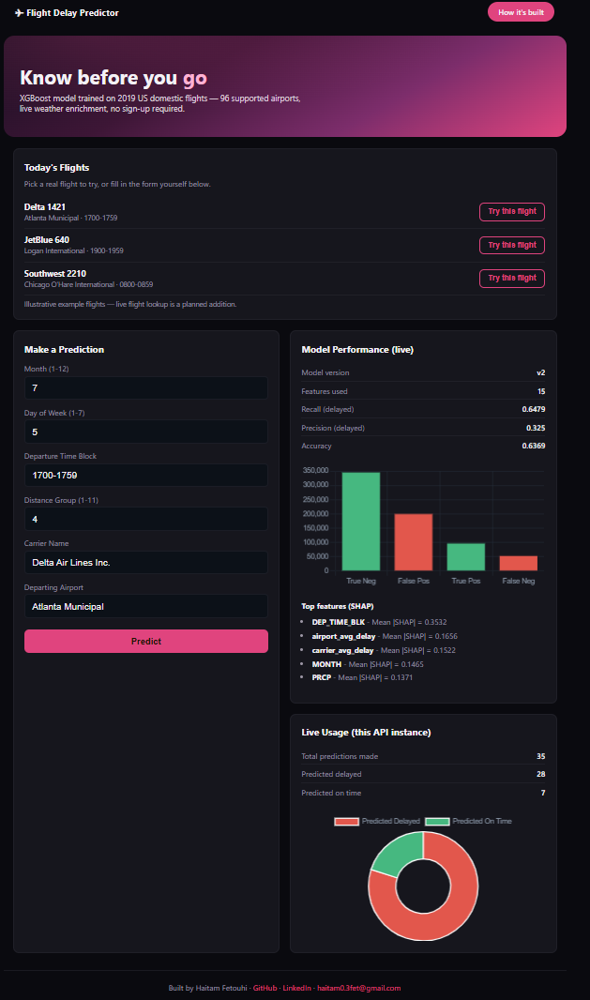
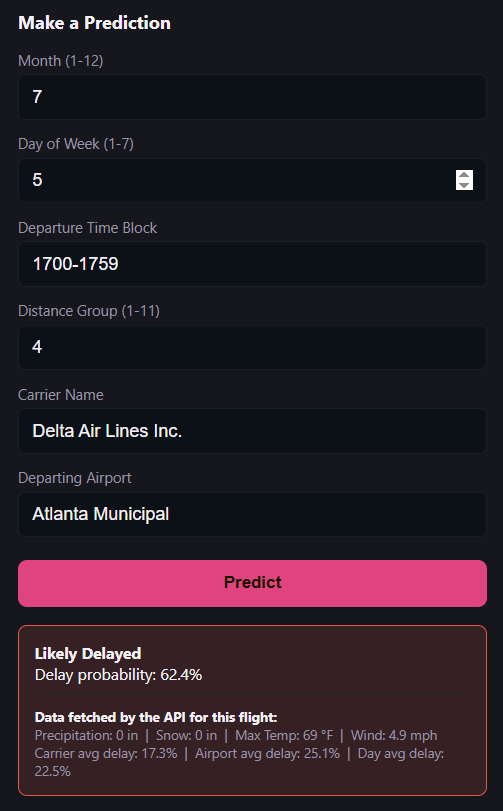
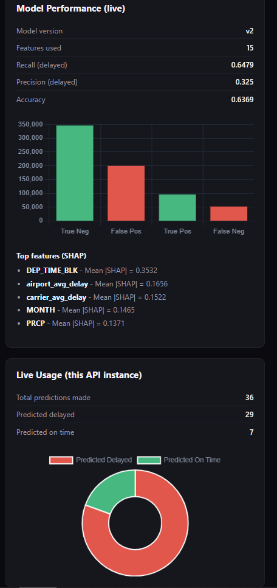
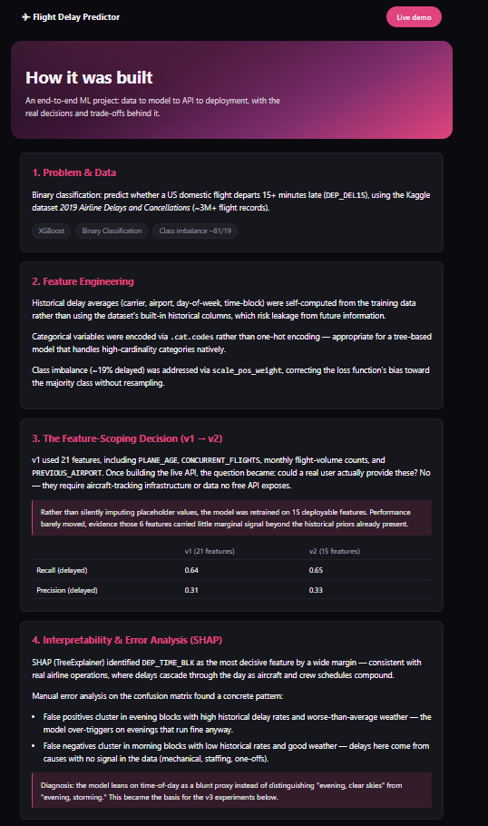
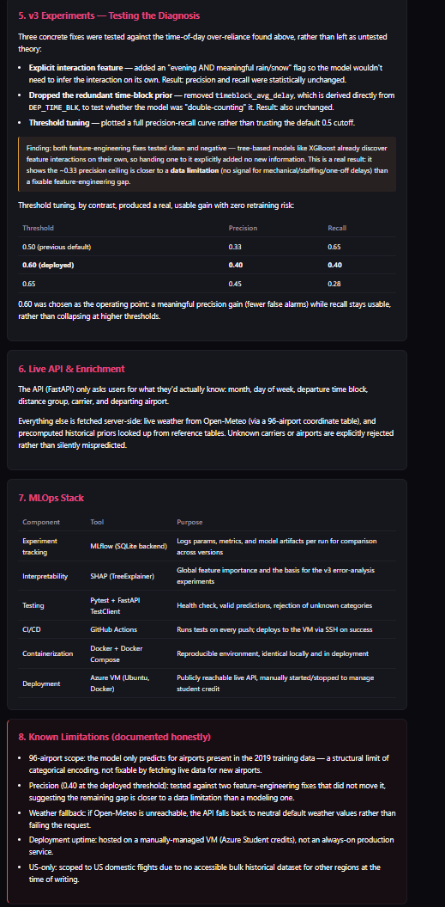

# Flight Delay Predictor

Predicting whether a US domestic flight will depart 15+ minutes late, using only the information a traveler would realistically have when booking or checking a flight.

**Live demo:** https://flightdelay.francecentral.cloudapp.azure.com
**Author:** Haitam Fetouhi ([GitHub](https://github.com/HaitamF) · [LinkedIn](https://www.linkedin.com/in/haitam-fetouhi-22797b3bb) · haitam0.3fet@gmail.com)

---

## The Business Problem

Flight delays cost travelers time and money, and cost airlines an estimated billions of dollars a year in crew rescheduling, missed connections, and passenger compensation. Most public delay tools show historical statistics after the fact. This project asks a narrower, more useful question: **before you fly, can you get a realistic probability that your specific flight will be delayed, using only information you already have?**

That constraint, "only information a real user actually has," shaped almost every technical decision in this project, from which features made it into the final model to how the API enriches a request behind the scenes.

## Screenshots



**Prediction form**



**Model performance dashboard**



**About / pipeline page**


---

## How It Works, End to End


User fills in 6 fields (month, day, time block, trip length, carrier, airport)
        |
        v
FastAPI enriches the request server side:
  - live weather (Open Meteo)
  - historical delay averages (carrier / airport / day / time block)
        |
        v
XGBoost model returns a delay probability
        |
        v
Result + the enrichment data used is shown back to the user

The core design principle: the user is never asked for anything they could not reasonably know. Everything else, weather, historical delay rates, is fetched automatically.

## The Model

**Task:** binary classification, predicting `DEP_DEL15` (departs 15+ minutes late).
**Data:** Kaggle's *2019 Airline Delays and Cancellations* dataset (~3M+ US domestic flight records).
**Algorithm:** XGBoost, chosen for native handling of categorical variables and class imbalance without heavy preprocessing.

### Version history

| Version | Features | Recall (delayed) | Precision (delayed) | Notes |
|---|---|---|---|---|
| v1 | 21 | 0.64 | 0.31 | Included features a real user could not provide (plane age, live traffic counts, previous leg) |
| v2 | 15 | 0.65 | 0.33 | Dropped the 6 non-deployable features; performance barely moved, confirming they carried little signal |
| v3 (deployed) | 15 + threshold tuning | 0.40 | 0.40 | Tested two feature engineering fixes for a known bias (both negative, see below); shipped a tuned decision threshold instead |

### Interpretability (SHAP)

`TreeExplainer` on a 3,000 row sample identified `DEP_TIME_BLK` (scheduled departure time window) as the dominant feature by a wide margin, consistent with how delays cascade through an aircraft's schedule across a day.

Manual error analysis on the confusion matrix found a clear pattern:
- **False positives** (predicted delayed, actually on time) cluster in evening time blocks with historically high delay rates and worse than average weather.
- **False negatives** (missed real delays) cluster in morning time blocks with historically low delay rates and good weather. These are delays with causes the model has no signal for at all: mechanical issues, staffing, one off disruptions.

**Diagnosis:** the model leans on time of day as a blunt proxy rather than distinguishing "evening, clear skies" from "evening, storming."

### Testing the diagnosis (v3 experiments)

Two concrete fixes were implemented and tested, not just theorized:

1. **Explicit interaction feature** ("evening AND meaningful rain/snow" flag), so the model would not need to infer the interaction on its own.
2. **Dropped the redundant historical prior** (`timeblock_avg_delay`, derived directly from `DEP_TIME_BLK`), to test whether the model was double counting the same signal.

**Result: both changes were statistically indistinguishable from the baseline.** This is treated as a real, useful finding rather than a dead end: tree based models like XGBoost already discover feature interactions on their own, so handing one to it explicitly added no new information. It suggests the ~0.33 precision ceiling is closer to a **data limitation** (no signal for mechanical or staffing related delays exists in this dataset) than a fixable feature engineering gap.

**What did work:** tuning the decision threshold. Plotting a full precision recall curve rather than trusting the default 0.5 cutoff:

| Threshold | Precision | Recall |
|---|---|---|
| 0.50 (previous default) | 0.33 | 0.65 |
| **0.60 (deployed)** | **0.40** | **0.40** |
| 0.65 | 0.45 | 0.28 |

0.60 was chosen as the operating point: a meaningful reduction in false alarms while recall stays usable, on the assumption that a user checking a flight would rather see fewer, more trustworthy warnings than catch every possible delay at the cost of noise.

## API

Built with FastAPI. The `/predict` endpoint only requires six fields a real user would know:

`MONTH, DAY_OF_WEEK, DEP_TIME_BLK, DISTANCE_GROUP, CARRIER_NAME, DEPARTING_AIRPORT`

Everything else is enriched server side at request time:
- **Weather** (precipitation, snow, temperature, wind), live from the free Open Meteo API, using a hand compiled coordinate table for the 96 supported airports. Falls back to neutral defaults if Open Meteo is unreachable, and this fallback is disclosed rather than silent.
- **Historical priors** (carrier, airport, day of week, and time block average delay rates), precomputed from the training data.

An unknown carrier or airport (outside the model's training vocabulary) returns an explicit 400 error rather than a silent, unreliable guess.

| Endpoint | Method | Purpose |
|---|---|---|
| `/predict` | POST | Returns delay probability + the enrichment data used |
| `/health` | GET | Confirms the API and model are up |
| `/model-stats` | GET | Training performance metrics, served dynamically from the last training run |
| `/stats` | GET | Live usage counter for this running instance |
| `/todays-flights` | GET | Cached, real scheduled departures for a small set of demo airports |

## Tech Stack

**Modeling:** Python, XGBoost, pandas, SHAP
**API:** FastAPI, Pydantic
**MLOps:** MLflow (experiment tracking, SQLite backend), pytest (automated tests)

**Infrastructure:** Docker, Docker Compose, GitHub Actions (CI/CD), Caddy (automatic HTTPS reverse proxy)

**Deployment:** Azure VM (Ubuntu), Azure for Students subscription
**Frontend:** Plain HTML/CSS/JS, Chart.js

## Project Structure
```
flight-delay-predictor/
├── src/
│   ├── data_ingestion.py
│   ├── features.py          # computes historical priors
│   ├── train.py              # trains model, logs to MLflow
│   ├── error_analysis.py     # confusion matrix breakdown by feature
│   └── explain.py            # SHAP global importance
├── api/
│   ├── main.py                # FastAPI app: enrichment, prediction, live stats
│   ├── schemas.py
│   └── *.json                 # historical priors, airport coordinates, live stats
├── models/
│   ├── model.pkl, encoders.pkl
│   └── model_card.md
├── frontend/
│   ├── index.html              # prediction form + live dashboard
│   └── about.html              # full pipeline writeup, this project's "how it's built"
├── tests/test_api.py
├── .github/workflows/ci.yml    # test + deploy pipeline
├── Dockerfile, docker-compose.yml, Caddyfile
```

## Running Locally

```bash
git clone https://github.com/HaitamF/flight-delay-predictor.git
cd flight-delay-predictor
pip install -r requirements.txt

# Train (or use the committed model.pkl to skip this)
python src/train.py

# Run the API
python -m uvicorn api.main:app --reload

# Serve the frontend separately
cd frontend
python -m http.server 5500
```

Or with Docker:
```bash
docker compose up --build
```

## Known Limitations

Documented honestly, not hidden:

- **96 airport scope.** The model only predicts for airports present in the 2019 training data. This is a structural limit of categorical encoding, not something fixable by adding a live data source.
- **Precision (0.40 at the deployed threshold).** Roughly 3 in 5 "delayed" predictions are correct. Two feature engineering fixes were tested against this and did not move it, suggesting the remaining gap is closer to a genuine data limitation than a modeling one, see the model section above.
- **US domestic flights only.** No accessible bulk historical dataset exists for other regions (Morocco included) at the time of writing; most alternatives are commercial APIs with quotas too small for training a model.
- **Distance group is approximate for live flights.** The training data's distance bucket (1 to 11) does not come directly from the live flight API used for the "today's flights" feature, so it is estimated rather than exact for those entries.
- **Weather fallback.** If the live weather API is unreachable, neutral default values are used instead of failing the request.
- **Deployment uptime.** Hosted on a manually managed Azure VM (student credits), not an always on production service. It may be offline between demo sessions.

## Future Work

- Live flights dashboard using a paid aviation data API with proper rate limits (current version uses a free tier, cached and rate limited).
- Expand beyond US domestic flights if an accessible historical dataset becomes available.
- Revisit precision further with a larger feature set if a source for delay cause data (mechanical, staffing, weather, etc.) can be found.

## Contact

Haitam Fetouhi
[GitHub](https://github.com/HaitamF) · [LinkedIn](https://www.linkedin.com/in/haitam-fetouhi-22797b3bb) · haitam0.3fet@gmail.com